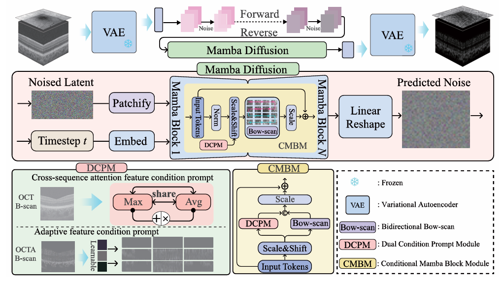

## CPGMD

## Conditional Prompt Guided Mamba Diffusion for OCT to OCTA Image Generation


> **Abstract:**  Optical Coherence Tomography Angiography (OCTA) provides high-resolution three-dimensional visualization of the retinal vascular system and plays a vital role in the screening and diagnosis of retinal diseases. However, the acquisition of high-quality OCTA images heavily relies on expensive and sophisticated imaging devices, which limits their widespread clinical application. To address this limitation, we propose a Conditional Prompt Guided Mamba Diffusion (CPGMD) for generating an OCTA image from the corresponding retinal OCT. Specifically, we design an enhanced Mamba block, where multiple Mamba blocks are connected via residual paths to improve the modeling of noise in the diffusion process. Furthermore, we introduce a bidirectional bow-scan strategy to mitigate the limitations of conventional Mamba-based modeling, thereby enhancing the visual fidelity of the generated OCTA images. To further guide the denoising process, we develop a conditional prompt mechanism that integrates cross-sequence attention and an adaptive feature condition prompt, enabling the generation of more discriminative OCTA. Experiments on both public and private datasets demonstrate that the CPGMD effectively leverages OCT to generate high-fidelity OCTA images, providing a promising alternative for OCTA acquisition.

⭐If this work is helpful for you, please help star this repo. Thanks!🤗


## 📑 Contents

- [News](#news)
- [Installation](#installation)
- [Datasets](#Datasets)
- [Citation](#cite)


## <a name="Real-SR"></a> 🥇 The proposed CPGMD architecture


<p align="center">
    
</p>


## <a name="news"></a> 🆕 News

 The code is being uploaded. 


## <a name="installation"></a> Installation

This codebase was tested with the following environment configurations. It may work with other versions.

- CUDA 11.7
- Python 3.9
- PyTorch 1.13.1 + cu117
- NVIDIA 4090 GPU (24 GB) 

To use the selective scan with efficient hard-ware design, the `mamba_ssm` library is advised to install with the folllowing command.

```
pip install causal_conv1d==1.0.0
pip install mamba_ssm==1.0.1
```

## <a name="Datasets"></a> Datasets

The dataset is obtained as follows:

OCTA-500: A retinal dataset for optical coherence tomography angiography study.

## <a name="cite"></a> 🥰 Citation

Please cite us if our work is useful for your research.


